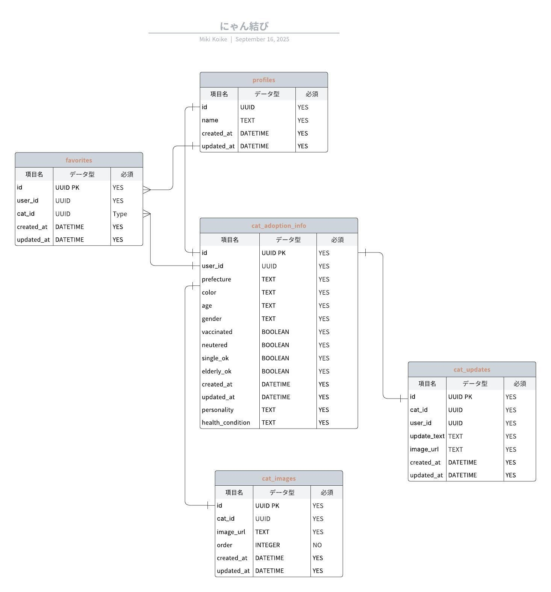

# にゃん結び 🐱

保護ねこと新しい家族をつなぐマッチングプラットフォーム

---

## 📌 アプリ URL

🌐 **[https://nyan-musubi.vercel.app/](https://nyan-musubi.vercel.app/)**

### デモアカウント

アプリの機能を以下のアカウントでお試しいただけます：

- **ID**: `test@test.jp`
- **Password**: `testtest`

---

## 📖 概要

**にゃん結び**は、個人でねこを保護した方と、保護ねこを引き取りたい方をつなぐマッチングアプリです。

保護した方が簡単に里親募集を投稿でき、引き取りたい方が条件に合うねこを検索・お気に入り登録できます。新しい家族との出会いをサポートします。

---

## 💡 作成背景

### 課題

- **保健所や保護猫団体からの引き取りは条件が厳しい**  
  飼育環境や家族構成など、厳しい条件により引き取りを断念し、ペットショップで購入してしまう方が多い

- **個人で保護した場合、里親探しが困難**  
  身の回りで引き取り手を探すのは難しく、保護しても飼えないという問題がある

### 解決策

このような現状をなんとかしたい、個人間でもっと気軽に保護ねこの里親マッチングができる仕組みを作りたいという想いから、このアプリを開発しました。

---

## 🗓️ 開発期間

- **開発期間**: 2025 年 9 月 10 日 〜 10 月 26 日
- **合計時間**: 約 80 時間

---

## 🎨 設計資料

### ER 図（テーブル定義書）

Lucid で設計したデータベース構造：

### デザインカンプ

Figma で作成した UI デザイン：

🔗 **[Figma デザインを見る](https://www.figma.com/design/px40erwYb5d1735asP2Gcz/%E3%83%AF%E3%82%A4%E3%83%A4%E3%83%BC%E3%83%95%E3%83%AC%E3%83%BC%E3%83%A0?node-id=0-1&p=f&t=gPEMOBZDAJksQcW3-0)**

---

## 🛠️ 使用技術

### フロントエンド

- **Next.js 15** (App Router)
- **React 19**
- **TypeScript**
- **CSS Modules**

### バックエンド

- **Supabase**
  - PostgreSQL（データベース）
  - Authentication（認証）
  - Storage（画像保存）
  - Row Level Security（RLS）

### インフラ・デプロイ

- **Vercel**

### 開発ツール

- **Figma** - UI デザイン
- **Lucidchart** - ER 図作成
- **Git/GitHub** - バージョン管理

---

## ✨ 実装済み機能

### 認証機能

- ユーザー登録
- ログイン・ログアウト

### 投稿機能

- 保護ねこの投稿作成
- 新規投稿追加・既存投稿の編集
- 複数画像のアップロード
- サムネイル設定

### 検索・フィルタリング

- 都道府県・毛色・年齢・性別での絞り込み
- ワクチン接種・避妊去勢の有無でのフィルタ
- 単身者・高齢者応募可否での検索
- 登録日・更新日でのソート

### お気に入り機能

- 投稿のお気に入り追加・削除
- お気に入り一覧表示

### コメント機能

- 投稿へのコメント投稿
- コメント削除

### 譲渡管理

- 譲渡済みステータスへの変更
- 譲渡済みねこの専用ページ表示

### その他

- ページネーション
- レスポンシブデザイン

---

## 🚀 今後の実装予定

### 近況報告機能

譲渡後、新しい家族からの成長記録や日常の様子を投稿できる機能

### ダイレクトメッセージ

投稿主と引き取り希望者が安全にやり取りできるプライベートメッセージ機能

### 相互評価システム

譲渡元と譲渡先を相互に評価し、より安全で信頼できるマッチングを実現

---

## 📝 ライセンス

このプロジェクトは MIT ライセンスの下で公開されています。

---

## 👤 作成者

**MIKI KOIKE**

- GitHub: [@mikikoike0204](https://github.com/mikikoike0204)

---

## 🙏 謝辞

このプロジェクトを通じて、一匹でも多くの保護ねこが幸せな家族と出会えることを願っています。
